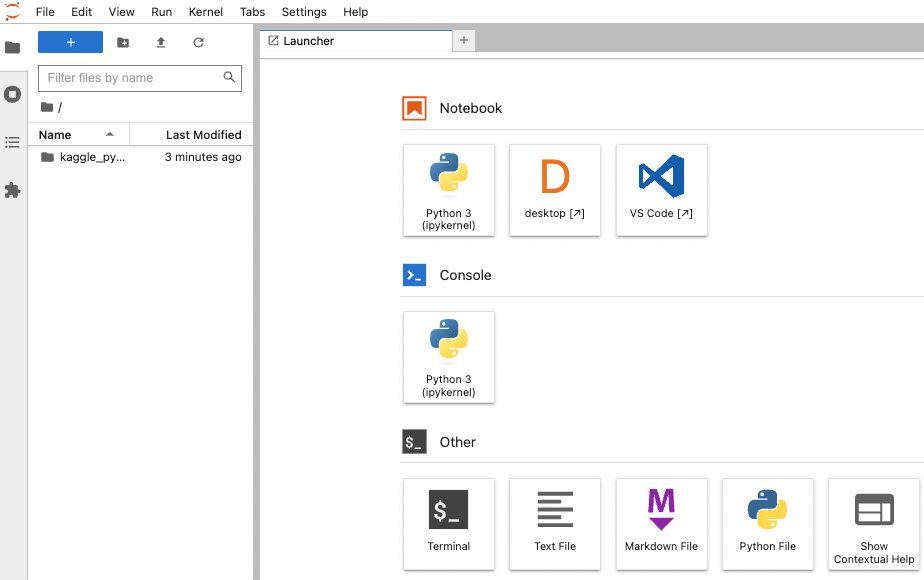
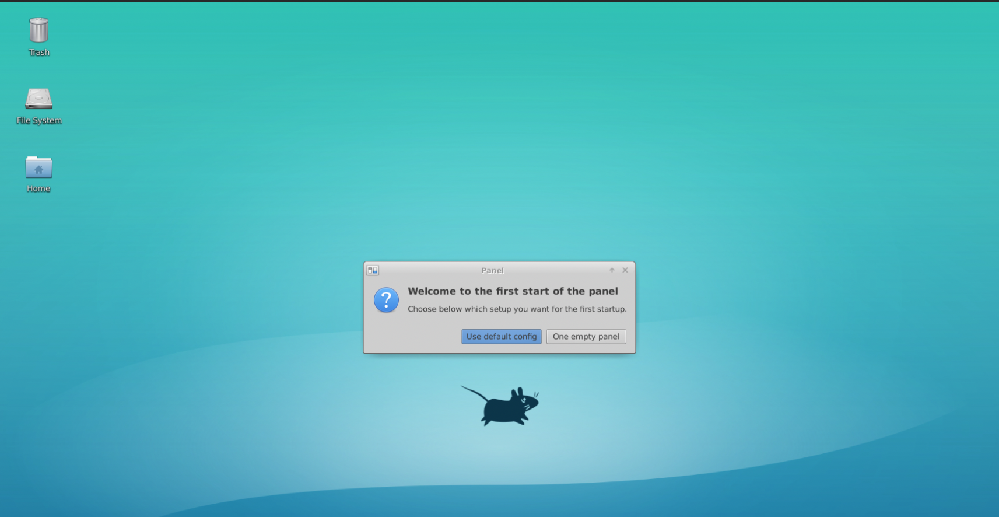

# kaggle_pytorch_docker
このリポジトリは私がkaggleで機械学習をするためのdocker imageを作成するためのものです。  
機械学習をしたいけど環境構築が難しくてできたいという方の役に立てば幸いです。

## 1. Preparation
機械学習ようの環境を構築するためにまずdockerをインストールしてください。  
dockerを利用できる環境の作り方がわからないという方は[NVIDIA Dockerって今どうなってるの？](https://medium.com/nvidiajapan/nvidia-docker-%E3%81%A3%E3%81%A6%E4%BB%8A%E3%81%A9%E3%81%86%E3%81%AA%E3%81%A3%E3%81%A6%E3%82%8B%E3%81%AE-20-09-%E7%89%88-558fae883f44)を参考にしてください。

## 2. Build Image
1.を基にdocker環境が構築できましたら、機械学習ようのdocker imageをビルドしましょう！  
以下のコマンドを実行してください。
```
$ git clone https://github.com/oriki101/kaggle_pytorch_docker.git #このリポジトリをclone
$ cd kaggle_pytorch_docker
$ ./build.sh
```
もし実行権限がないようでしたらchmod等で権限を適切に付与してください。  
こちらの処理にはものすごく時間がかかります。

## 3. Using docker image
dockerコマンドとdocker-composeコマンドを利用した環境の建て方を用意しています。  
現状の構成ではどちらを利用していただいても大丈夫です。  
もし複数のコンテナを立てたいという場合はdocker-composeのものを参考に、改良してください。

### dockerコマンドでの起動
```
$ ./run.sh
```
### docker-composeコマンドでの起動
```
$ ./compose_up.sh
```

### 機械学習環境へのアクセス
上記のコマンドを実行すると機械学習環境が起動されます。
現在操作しているPCで実行した場合は  
localhost:8888  
にアクセスしてください。  

リモートPCで環境を起動した場合は  
実行したPCのIPアドレス:8888  
にアクセスしてください。

## 4. Explanation of envirionment
機械学習環境にアクセスすると下の画像のような画面になると思います。



### Python3
Notebook欄のPython3は.ipynbのファイルを生成し、インタラクティブにスクリプトを描くことができます。

### desktop
真ん中のdesktopはnovncでGUI操作できるデスクトップを作成してくれます。  
ボタンをクリックすると新しいタブができ、少し時間が経つと下図のようなデスクトップ画面が開きます。  
強化学習などでGUIアプリを起動したい場合に利用してください。



### VS Code
一番右のVS CodeはVisual Studio Codeの環境を開いてくれます。  
.pyファイルやconfigファイルなどを記述する際は利用してみてください。
